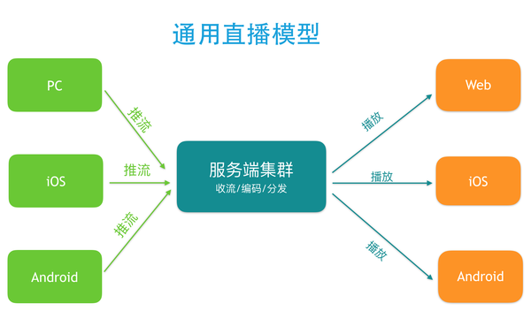

最近直播很火，很多大公司和中小创业者都想抓住这个机会做一番事业。「如何搭建一个完整的视频直播系统？」这是一个很大的问题，不是一两个答案能够解释清楚的，但我还是尽量技术和创业的角度提供给题主尽可能多的信息。

正如 @姚冬 所说，一个完整的直播系统大致包含这几个环节：采集、前处理、编码、传输、解码和渲染。在两端传输的过程中再加上一个服务端处理。大致的模型如下：

在主播推流端涉及到的环节有采集、前处理和编码，在观众端涉及到的环节就是解码和渲染，在这两个端之间建立起传输通道的则是服务端，它负责接收主播端的推流，将其处理之后分发给观众播放端：

1. 采集

采集是播放环节中的第一环，iOS 系统因为软硬件种类不多，硬件适配性较好，所以比较简单。Android 则不同，市面上硬件机型非常多，难以做到一个库适配所有硬件。PC 端的采集也跟各种摄像头驱动有关，推荐使用目前市面上最好用的 PC 端开源免费软件 OBS: Open Broadcaster Software

参考教程：斗鱼游戏直播教程-OBS直播软件篇[推荐]

2. 前处理

正如 @姚冬 所说，「80% 的主播没有美颜根本没法看。」不光是美颜，很多其它的视频处理如模糊效果、水印等也都是在这个环节做。目前 iOS 端比较知名的是 GPUImage 这个库，提供了丰富端预处理效果，还可以基于这个库自己写算法实现更丰富端效果：GitHub - BradLarson/GPUImage: An open source iOS framework for GPU-based image and video processing

Android 也有 GPUImage 这个库的移植：GitHub - CyberAgent/android-gpuimage: Android filters based on OpenGL (idea from GPUImage for iOS)

同时，Google 官方开源了一个伟大的库，覆盖了 Android 上面很多多媒体和图形图像相关的处理：https://github.com/google/grafika

3. 编码

编码主要难点有两个：1. 处理硬件兼容性问题。2. 在高 fps、低 bitrate 和音质画质之间找到平衡。

iOS 端硬件兼容性较好，可以直接采用硬编。而 Android 的硬编的支持则难得多，需要支持各种硬件机型，推荐使用软编。

4. 传输

传输涉及到很多端：
从主播端到服务端
从收流服务端到边缘节点
再从边缘节点到观众端

推流端和分发端理论上需要支持的并发用户数应该都是亿级的，不过毕竟产生内容的推流端在少数，和消费内容端播放端不是一个量级，但是他们对推流稳定性和速度的要求比播放端高很多，这涉及到所有播放端能否看到直播，以及直播端质量如何。

很多人吐槽现在的 CDN 不靠谱，我也承认传统的 CDN 在新时代显得心有余力不足。你能够借助 CDN 快速实现大规模的流分发，但是稳定高速的推流上传可能还需要自己做很多工作。这也是为什么我们七牛在这方面做这么多工作的原因之一。

如果要自己动手做，服务端方面最好的参考资料可能是这个了：v3_CN_Home · ossrs/srs Wiki · GitHub

国民首席、熊猫 TV 首席架构师杨武明在「Gopher 北京聚会」上做过一个「Golang在视频直播平台的高性能实践」的分享，值得参考：https://mp.weixin.qq.com/s?__biz=MzAwMDU1MTE1OQ==&mid=404230356&idx=1&sn=6b73f971c4cf1170adaf4d249480ed9a&scene=1&srcid=0301qrbBZPrLxORTiD5D5IO1&key=b28b03434249256be5dfe068862f4c51d10c5e16b3659de35ce26bd4868f3a186366844bc7a8d3eaf48192b75536009b&ascene=0&uin=MTUwMTI2NjQ2MA%3D%3D&devicetype=iMac+MacBookPro11%2C2+OSX+OSX+10.11.4+build(15E65)&version=11020201&pass_ticket=TplbLKZJE2ZwCTACdAM6vZw%2FaJtVhaRrbn0An3uI6OAbctOQaAXHM9DZBdalM5Fi

PPT 地址：ppt/GolangPerformancePractice.pdf at master · yangwm/ppt · GitHub

5. 服务端处理

为了让主播推上来的流适配各个平台端各种不同协议，需要在服务端做一些流处理工作，比如转码成不同格式支持不同协议如 RTMP、HLS 和 FLV，一路转多路流适配各种不同的网络状况和不同分辨率的终端设备。

6. 解码和渲染

解码和渲染，也即音视频的播放，目前 iOS 端的播放兼容性较好，在延迟可接受的情况下使用 HLS 协议是最好的选择。Android 的硬件解码和编码一样也存在兼容性问题，目前比较好的开源播放器是基于 ffplay 的 ijkplayer：GitHub - Bilibili/ijkplayer: Android/iOS video player based on FFmpeg n3.0, with MediaCodec, VideoToolbox support.

目前，我们七牛在客户端采集、编码解码以及推流拉流加速方面做了很多工作，以上干货也是基于这个过程中踩过的坑整理出来的：Pili Streaming Cloud · GitHub

既然是创业，肯定要考虑到前期投入和未来的商业化，这方面我建议先看看熊猫 TV 庄明浩的长文分析：http://zhuanlan.zhihu.com/p/20717041

他在投入熊猫 TV 创业之前以投资人的视角从投资的角度深入观察、分析了视频和直播行业 2 年。